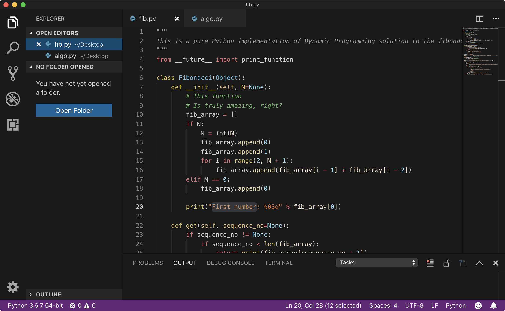

# Panther Dark Theme

Dark theme for VSCode. In part based on Microsoft's version of [Monokai](https://github.com/Microsoft/vscode/tree/master/extensions/theme-monokai) theme, as well as the VSCode default [Dark+](https://github.com/Microsoft/vscode/blob/master/extensions/theme-defaults/themes/dark_plus.json) theme.

With the following changes:

1. It's darker than Dark+. Tastefully so though: not completely black.
2. Comments are green for added visibility. Why do most VSCode custom themes have grey comments?
3. Tweaked to work well with Python and not only JS like a lot of themes.

